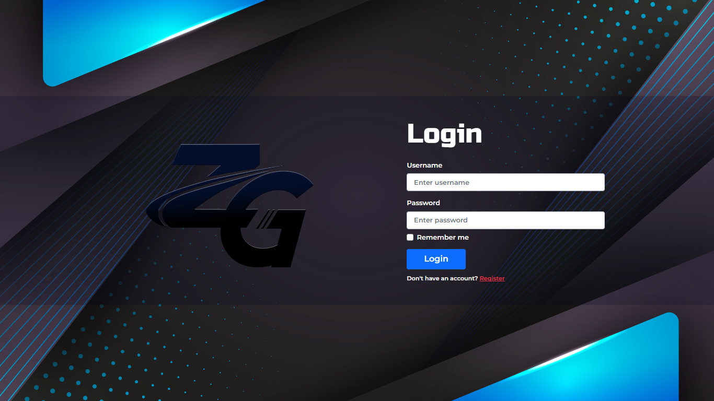
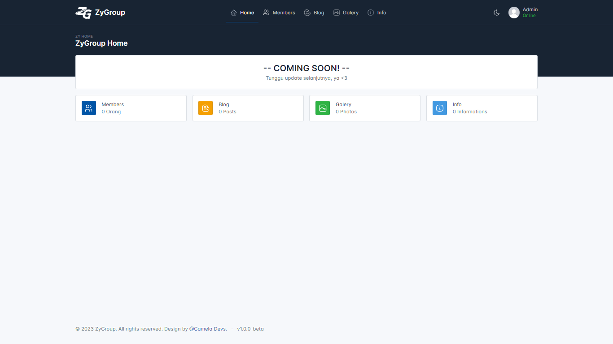
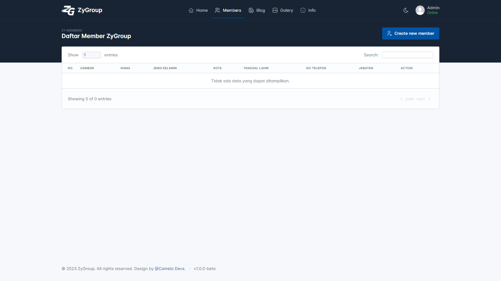
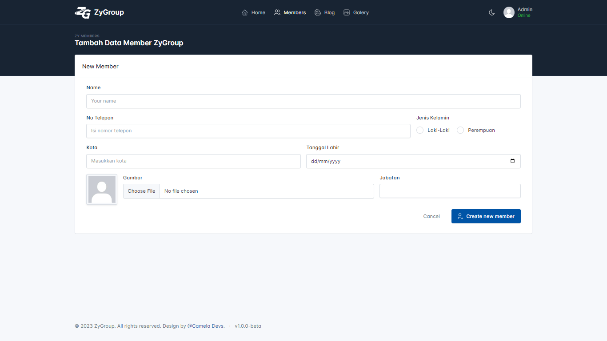

 
  

  
<h1 align="center"> ZyGroup </h1>

# Dashboard for ZyGroup
Sebuah website dashboard versi beta yang bermula dari kegabutan semata. Dibuat dengan HTML, CSS, JavaScript, Bootstrap, dan PHP. Dashboard ini dibuat kurang lebih selama 1 bulan. Kedepannya akan diusahakan mengupdate menjadi lebih baik lagi.  

## Languages and Tools:

     

## Demo
[http://zygroup.rf.gd/](http://zygroup.rf.gd/)

## Login
`username : admin` | `password : admin1234`

## Sreenshot

 
  
  
  
  

<h3 align="center"> 🔗 My Social Media </h3>

